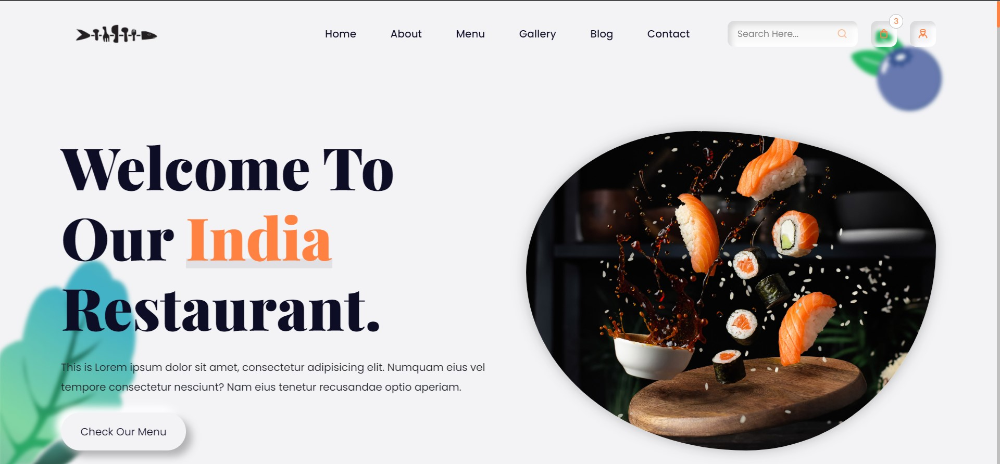
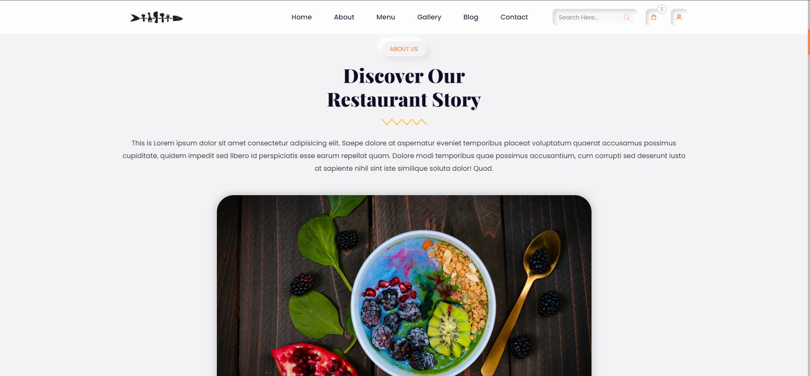
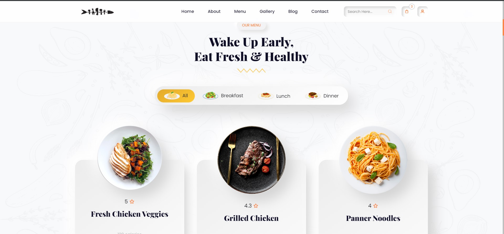

# Future Ready Talent Project

The Complete Responsive Food Website. This website has menu which again has varieties of categories, gallery which includes different kinds of images, blog Chef info and FAQ section
This Website is deployed on Azure with help of Azure Static Web apps.

**Project Link** : 

## Features and Functionalities

- User is able to book a table through the website.
- Interactive and responsive UI.
- Has many graphical and visual innovative effects.
- Have an aesthetically pleasing visual design and architecture.
- Has collection of many web pages including Home, About Us, Contact, Menu, Chef Staff pages etc.
- Included the feedback Survey form to increase the scope of improvement 

## Screenshots
### Home Page -

### About Us Page - 

### Menu Page - 

## Tech Stack

- [Azure(Hosting)](https://azure.microsoft.com/en-in/features/azure-portal/)
- HTML
- CSS
- Bootstrap
- JavaScript
